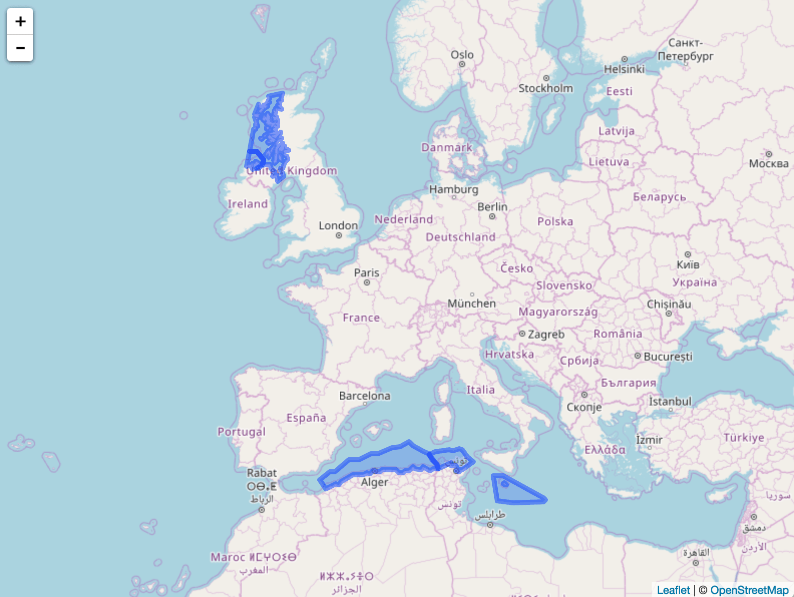

# mregions

[](https://cranchecks.info/pkgs/mregions)
[](https://travis-ci.org/ropensci/mregions)
[](https://codecov.io/github/ropensci/mregions?branch=master)
[](https://github.com/r-hub/cranlogs.app)
[](https://cran.r-project.org/package=mregions)
[](https://github.com/ropensci/software-review/issues/53)

`mregions` - Get data from <https://www.marineregions.org>

Some data comes from the [Flanders Marine Institute (VLIZ)
geoserver](http://geo.vliz.be/geoserver/web/)

`mregions` is useful to a wide diversity of R users because you get
access to all of the data MarineRegions has, which can help in a variety
of use cases:

-   Visualize marine regions alone
-   Visualize marine regions with associated data paired with analysis
-   Use marine region geospatial boundaries to query data providers
    (e.g., OBIS (<https://www.obis.org>))
-   Geocode - get geolocation data from place names
-   Reverse Geocode - get place names from geolocation data

## Install

``` r
install.packages("mregions")
```

Development version

``` r
devtools::install_github("ropensci/mregions")
```

``` r
library("mregions")
```

## GeoJSON

Get region

``` r
res1 <- mr_geojson(key = "Morocco:dam")
```

Get helper library

``` r
install.packages("leaflet")
```

Plot data

``` r
library('leaflet')
leaflet() %>%
  addProviderTiles(provider = 'OpenStreetMap') %>%
  addGeoJSON(geojson = res1$features) %>%
  setView(-3.9, 35, zoom = 10)
```


## Shape

Get region

``` r
res2 <- mr_shp(key = "MarineRegions:eez_iho_union_v2", maxFeatures = 5)
```

Get helper library

``` r
install.packages("leaflet")
```

Plot data

``` r
library('leaflet')
leaflet() %>%
  addProviderTiles(provider = 'OpenStreetMap') %>%
  addPolygons(data = res2)
```



## Convert to WKT

From geojson

``` r
res3 <- mr_geojson(key = "Morocco:dam")
mr_as_wkt(res3, fmt = 5)

#> [1] "MULTIPOLYGON (((41.573732 -1.659444, 45.891882 ... cutoff
```

From shp object (`SpatialPolygonsDataFrame`) or file, both work

``` r
mr_as_wkt(mr_shp(key = "MarineRegions:eez_iho_union_v2"))

#> [1] "GEOMETRYCOLLECTION (POLYGON ((-7.25 ... cutoff
```

## Contributors

-   [Scott Chamberlain](https://github.com/sckott)
-   [Francois Michonneau](https://github.com/fmichonneau)
-   [Pieter Provoost](https://github.com/pieterprovoost)
-   [Michael Sumner](https://github.com/mdsumner)
-   [Lennert Schepers](https://github.com/LennertSchepers)
-   [Salvador Fernandez](https://github.com/salvafern)

## Meta

-   Please [report any issues or
    bugs](https://github.com/ropensci/mregions/issues).
-   License: MIT
-   Get citation information for `mregions` in R doing
    `citation(package = 'mregions')`
-   Please note that this project is released with a [Contributor Code
    of Conduct](https://github.com/ropensci/mregions/blob/master/CONDUCT.md). By participating in this project you agree
    to abide by its terms.

[](https://ropensci.org)
